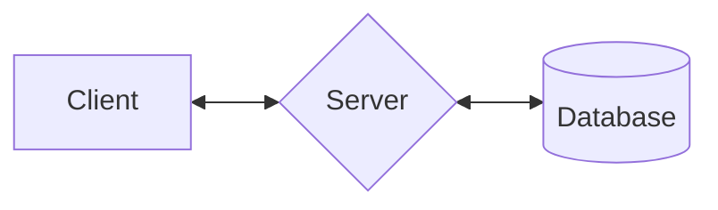
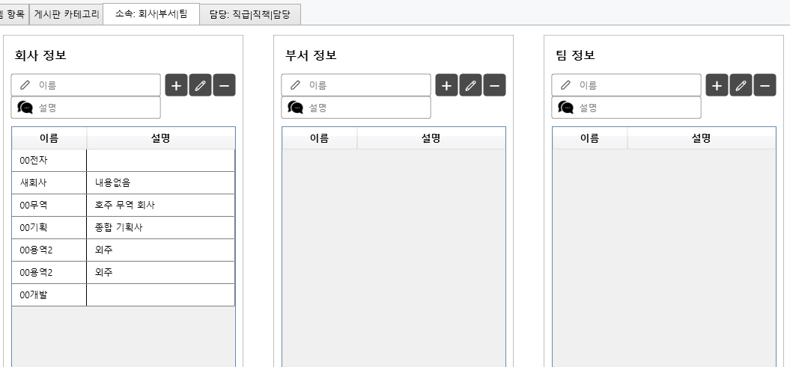

## 📌 Community-App
\- 커뮤니티 그룹웨어 (WPF Client / Node.js Server / MariaDB)
___
- **\# 프로젝트 개요**
- 이름: Community-App
- 목적: 사내 업무 보조용 Windows CRUD 프로그램
- 기간: 2025.10.2 ~ 12.23
- 역할: 단독 개발
- 기능: 대시보드, 일정관리, 전자결재, 자유게시판, 채팅, 프로젝트 & 직원 관리
.
- **\# 기술 스택**
- 프론트엔드: WPF (.NET Framework 4.7.2)
- 백엔드: Node.js v22, Express v5
- 데이터베이스: MariaDB v11.8
- 통신: REST API, Socket.io
- 언어: C#, JavaScript
- 버전 관리: GitHub, Sourcetree

## 📌 프로젝트 구조
---

```
📦Community-App/
├──📁Community_Client_WPF/     # WPF 클라이언트 코드
├──📁Community_Server_Node/    # Node.js 서버 코드
├──📁Community_DB_MariaDB/     # DB 스키마, SQL
├──📁Community_Document/       # 기능 설명, 캡쳐 이미지, API/쿼리 등
└──📄README.md                 # 전체 설명

# 주요 기능
- 회원가입 및 로그인
- 홈 대시보드: 본인 정보, 출퇴근, 최근 공지/게시글, 프로젝트 등 표시
- 일정관리: 달력에 일정 생성/조회, 공공 데이터 포털 API 이용한 공휴일 표시
- 전자결재: 휴가계, 지출결의서 작성 및 승인/거부
- 게시판: 공지사항 및 자유게시판 조회/편집
- 채팅방: 채팅방 생성 및 참석, 메시지 전송
- 프로젝트 관리: 프로젝트 내용, 진행률에 대한 간트차트 조회/편집
- 직원 관리: 직원 등록/편집 및 직원 출퇴근, 근무시간 조회
- 시스템: 기초코드 생성 등
```

```
📦client: C#, WPF
├─📁Common/              # Config, 통신, 유틸리티 등
├─📁Images/              # 이미지, 아이콘, 커서파일 등
├─📁Models/              # View 바인딩용 모델 클래스
├─📁Resources/           # UI View/Control에 대한 Style, Template
├─📁View_Controls/       # 커스텀 Control
├─📁View_Converters/     # View 바인딩용 컨버터 클래스
├─📁ViewModels/          # View/Model 연결 및 사용자 액션, 통신 연계 등
├─📁Views/               # 화면 View, View 캐시, 마크업 확장 등
└─App.xaml
```

```
📦server: Node.js, Express
├─📁repositories/
├─📁routes/
├─📁services/
├─📁utils/
└─index.js

- 게시판 URL: 
1. 게시글 조회: post   : /list/select { post_category_id }
2. 게시글 작성: post   : /list/insert { employee_id, title, content }
3. 게시글 수정: put    : /list/update { id, title, content }
4. 게시글 삭제: delete : /list/delete { id }
  
- 프로세스 흐름
1. app.use > helmet header, HTTP finish log, cors
2. app.use > IP Check, API Key Check, Header Size Check, uuid, log
3. app.use > express.json body max size set
4. route: post(get) / post / put / delete + req.body.json + \*db + next
5. \*db: db_pool + sql (select / insert / update / delete) + result + log
6. 정상 / 에러 핸들 처리, log
```

```
📦database: MariaDB
│
│ # 테이블
├─tb_schedule
├─tb_approval_ ... (document, expense, line, vacation)
├─tb_posts / tb_post_ ... (category, comments)
├─tb_chat_ ... (members, messages, rooms)
├─tb_projects / tb_project_ ... (members, tasks, task_members)
├─tb_customers / tb_customer_ ... (products, services)
├─tb_products / tb_product_inventory
├─tb_employees / tb_employee_ ... (attendance, leaves, reviews)
├─tb_organization_ ... (locations, companies, departments, teams, 
│                       ranks, positions, roles, privileges)
├─tb_system_ ... (config, logs)
│
│ # 뷰
├─v_category
├─v_comments
├─v_employees
├─v_employee_attendance
├─v_posts
├─v_projects
├─v_project_tasks
├─v_schedule
├─v_teams
│
│ # 트리거
├─tr_log_insert_ ... (chat, customer, employee, product, project)
├─tr_post_comment_ ... (delete, insert)
├─tr_post_ ... (delete, insert)
│
│ # 프로시저
└─p_employee_ ... (daytime, weektime)
```

## 📌 샘플 이미지
---
1. 로그인 화면
![[./Community_Document/Sample/0.login_20251223_1712.png|600x320]]

2. 홈 화면
![[./Community_Document/Sample/1.home_20251221_2325.png|600x320]]

3. 일정관리 화면
![[./Community_Document/Sample/2.schedule_20251223_1652.png|600x320]]

4. 전자결재 화면
![[./Community_Document/Sample/3.approval_20251221_2329.png|600x320]]

5. 게시판 화면
![[./Community_Document/Sample/4.post_20251223_1713.png|600x320]]

6. 프로젝트 화면
![[./Community_Document/Sample/5.project_20251221_2325.png|600x320]]

7. 프로젝트 편집 화면
![[./Community_Document/Sample/6.project2_20251221_2327.png|600x320]]

8. 직원관리 화면
![[./Community_Document/Sample/7.employee_20251221_2325.png|600x320]]

9. 직원근태 화면
![[./Community_Document/Sample/8.employee2_20251221_2326.png|600x320]]

10. 기초코드 생성


