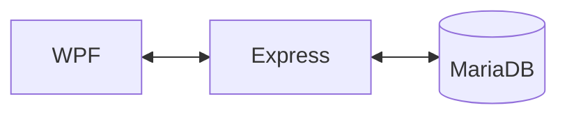
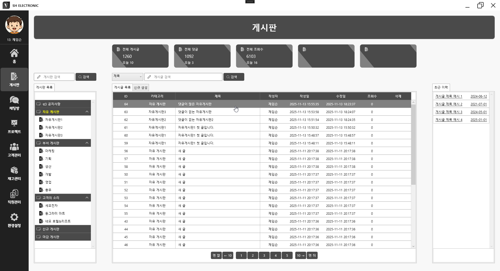
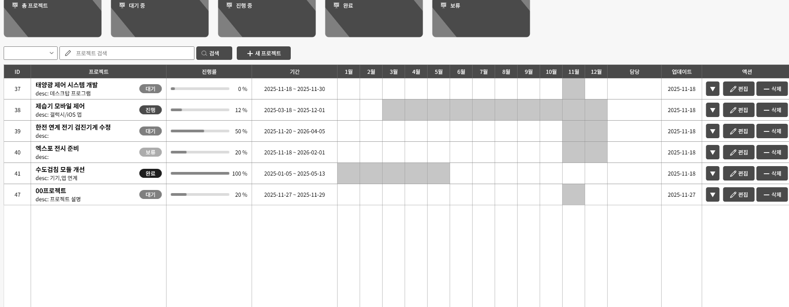

# Community-App
커뮤니티 그룹웨어 (WPF Client / Node.js Server / MariaDB)

## 📌 개요
- **목적**: C#/WPF, Node.js, MariaDB 기반의 CRUD 커뮤니티 애플리케이션 제작
- **개발 기간**: 2025.10.2 ~
- **기술 스택**: C#/WPF v4.7.2, Node.js/Express v22.15.1, MariaDB v11.8
- 역할: 단독 개발 (기획, 디자인, 설계, 구현, 테스트)
- 기능: 게시판, 채팅, 프로젝트 관리, 고객사 관리, 재고 관리, 직원 관리, 시스템 설정

## 📌 구조


```
📦Community-App/
├──📁Community_Client_WPF/     # WPF 클라이언트 코드
├──📁Community_Server_Node/    # Node.js 서버 코드
├──📁Community_DB_MariaDB/     # DB 스키마, SQL
├──📁Community_Document/       # 기능 설명, 캡쳐 이미지, API/쿼리 정리
└──📄README.md                 # 전체 설명
```


## 📌 샘플 이미지

### ※ 게시판



### ※ 기초코드 생성


### ※ 프로젝트 생성, 삭제



## 📌 Client: C#, WPF
```
Community_Client_WPF
├─community.sln
├─📁packages
│
📦community
├─📁Images/                # .png image files
├─📁Common/
│   ├─Handlers.cs          # delegate
│   ├─Notify.cs            # notify property changed
│   ├─Server.cs            # express restful api
│   └─Socket_IO_Client.cs  # web socket.io
├─📁Models/
│   └─M_ ... .cs           # 화면 모델 or DB Table 모델
├─📁ViewModels/
│   └─ViewModelBase.cs     # 공통 멤버 (ex: 현재 로그인 유저)
│       └─VM_ ... .cs      # 화면 별 뷰모델
├─📁Views/
│   ├─MethodBinding.cs     # 바인딩 헬퍼 (메소드를 직접 바인딩)
│   └─V_MainWindow.xaml    # 메인 윈도우
│       └─ViewCacheHost.cs # 뷰 캐시
│           └─V_ ... .xaml # 각 메뉴 화면
├─📁View_Controls/         # 복합 조합 ui
├─📁View_Converters/       # 뷰 컨버터 (ex: bool to int)
└─App.xaml
```


## 📌 Server: Node.js Express

- 프로세스 흐름
1. app.use > 보안 헤더 설정
2. app.use > HTTP finish 로그 생성
3. app.use > cors 도메인 체크
4. app.use > IP 체크, API Key 체크, Header Size 체크, uuid 부여, LOG
5. app.use > express.json 본문 크기 제한
6. app.use > 각 url 라우터 모듈 연결
7. route: get, post, put, delete
8. db_route: route + req.body.json + db + next
9. db_query: select, insert, update, delete
10. query: db_pool + query + result, LOG
11. app.use > 정상 핸들 처리, LOG
12. app.use > 에러 핸들 처리, LOG

```
📦Community_Server_Node/
├─index.js                # 메인 (서버 port)
├─logger.js               # Log 설정파일
├─.env                    # DB 접속 정보
├─📁routes/
│   ├─url_post.js         # 게시판 관리 URL (/post/...)
│   ├─url_chat.js         # 채팅방 관리 URL (/chat/...)
│   ├─url_project.js      # 프로젝트 관리 URL (/project/...)
│   ├─url_customer.js     # 고객사 관리 URL (/customer/...)
│   ├─url_product.js      # 재고 관리 URL (/product/...)
│   ├─url_employee.js     # 직원 관리 URL (/employee/...)
│   ├─url_organization.js # 기초정보 관리 URL (/organization/...)
│   └─url_system.js       # 시스템 정보 URL (/system/...)
├─📁services/
│   ├─service_databse.js  # DB 쿼리
│   ├─service_express.js  # Express 서버 설정 (보안, 기본URL, 최종 결과)
│   └─service_socket.js   # socket.io
└─📁utils/
    └─pick.js             # body.json 필터링 함수
```

```
로그인: post /employee/list/select { login_id, login_pw }

게시판: 
- 카테고리: post /post/category/select { name }
- 게시글 불러오기: post /post/list/select { post_category_id }
- 게시글 작성: post /post/list/insert { employee_id, title, content }
- 게시글 수정: put /post/list/delete { post_id, title, content }
- 댓글 불러오기: post /comment/select { post_id }

시스템: 
- 불러오기: post /system/config/select
```
## 📄 [API 명세서 보기](Server_API.md.md)


## 📌 DB: MariaDB

```
📦community
│
├─tb_post_category                # 게시판 카테고리
│   └─tb_posts                    # 게시판 리스트
│       └─tb_post_comments        # 게시판 별 댓글
│
├─tb_chat_rooms                   # 채팅방 리스트
│   ├─tb_chat_members             # 채팅방 멤버
│   └─tb_chat_messages            # 채팅방 멤버 별 메시지
│
├─tb_projects                     # 프로젝트 리스트
│   ├─tb_project_members          # 프로젝트 멤버
│   └─tb_project_tasks            # 프로젝트 작업
│       └─tb_project_task_members # 프로젝트 작업 별 멤버
│
├─tb_customers                    # 고객사 리스트
│   └─tb_customer_products        # 고객사 제품
├─tb_organization_locations       # 고객사 지역 정보
│
├─tb_products                     # 제품 리스트
│   └─tb_product_inventory        # 제품 입출고
│
├─tb_employees                    # 직원 리스트
│   ├─tb_employee_reviews         # 직원 평가
│   └─tb_employee_leaves          # 직원 휴가
├─tb_organization_companies       # 직원 소속 회사
│   └─tb_organization_departments # 직원 소속 부서
│       └─tb_organization_teams   # 직원 소속 팀
├─tb_organization_ranks           # 직원 직급
├─tb_organization_positions       # 직원 직책
├─tb_organization_roles           # 직원 담당
├─tb_organization_privileges      # 직원 권한 그룹
│
├─tb_system_config                # 시스템 값
└─tb_system_logs                  # 시스템 로그
```