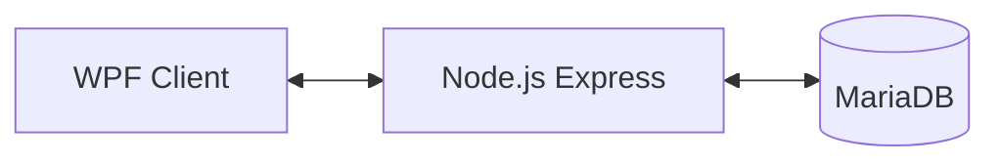
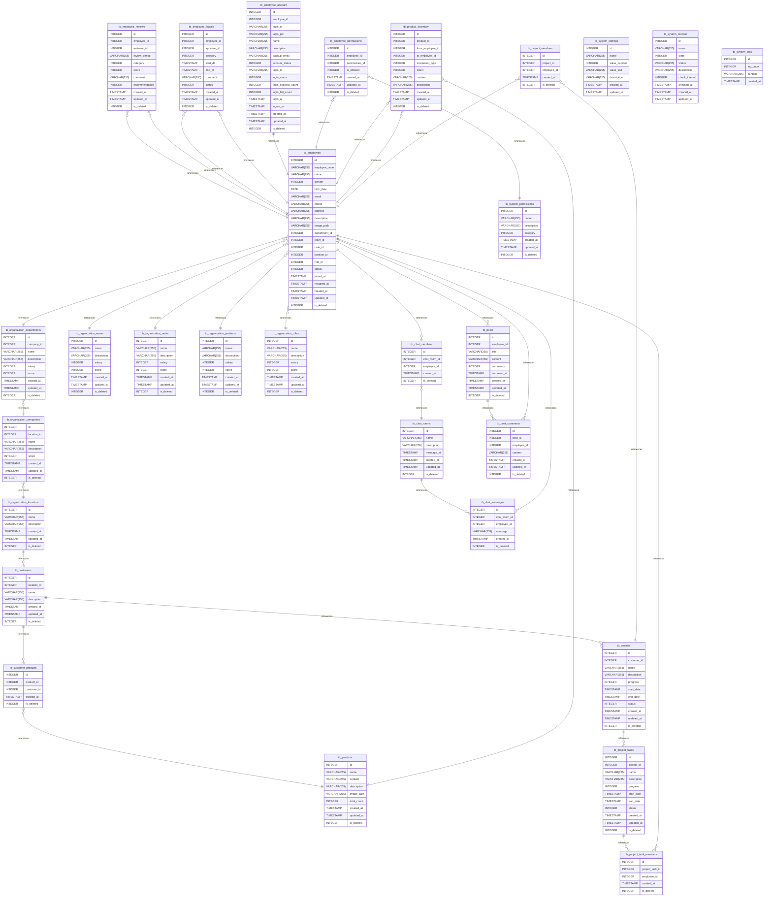

# Community-App
WPF client, Node.js server, MariaDB backend / React client planned

## 📌 개요
- **목적**: C#/WPF, Node.js, MariaDB 기반의 CRUD 커뮤니티 애플리케이션 제작
- **구성**: 클라이언트(WPF v4.7.2), 서버(Node.js/Express v22.15.1), DB(MariaDB v11.8)

---

## 📌 구조


```
Community-App/
│
├── Community_Client_WPF/     # WPF 클라이언트 코드
├── Community_Server_Node/    # Node.js 서버 코드
├── Community_DB_MariaDB/     # DB 스키마, SQL
├── Community_Document/       # 기능 설명, 캡쳐 이미지, API/쿼리 정리
└── README.md                 # 전체 설명
```

---

## 📌 WPF Client

| Function | Description           |
| -------- | --------------------- |
| 사용자      | 회원가입 / 로그인 / 로그아웃     |
| 게시판      | 게시글 등록 / 조회 / 수정 / 삭제 |
| 댓글       | 게시글별 댓글 작성 / 수정 / 삭제  |
| 파일 업로드   | 이미지 첨부 및 미리보기         |
| 관리자      | 사용자 관리, 게시글 관리        |

---

## 📌 Node.js API

| Method | Endpoint           | Description |
| ------ | ------------------ | ----------- |
| GET    | /                  | 서버 확인       |
| POST   | /login             | 사용자 로그인     |
| GET    | /board             | 게시글 목록 조회   |
| GET    | /board/page/search | 게시글 조건 조회   |
| POST   | /board/new         | 새 게시글 작성    |
| PUT    | /board/update      | 게시글 수정      |
| DELETE | /board/delete/:id  | 게시글 삭제      |
| GET    | /board/:id         | 댓글 조회       |
| POST   | /comment/new       | 댓글 작성       |

---

## 📌 MariaDB

| Table        | 주요 컬럼                               | 설명     |
| ------------ | ----------------------------------- | ------ |
| `tb_user`    | user_id, pw, name                   | 사용자 계정 |
| `tb_board`   | board_id, title, content, user_id   | 게시글 정보 |
| `tb_comment` | comment_id, board_id, text, user_id | 댓글     |



