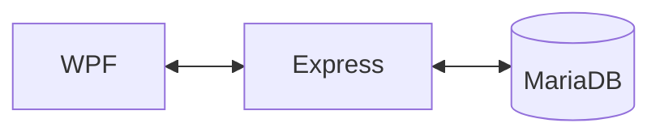

# Community-App
WPF client, Node.js server, MariaDB backend / React client planned

## 📌 개요
- **목적**: C#/WPF, Node.js, MariaDB 기반의 CRUD 커뮤니티 애플리케이션 제작
- **구성**: 클라이언트(WPF v4.7.2), 서버(Node.js/Express v22.15.1), DB(MariaDB v11.8)

---

## 📌 구조


```
Community-App/
│
├── Community_Client_WPF/     # WPF 클라이언트 코드
├── Community_Server_Node/    # Node.js 서버 코드
├── Community_DB_MariaDB/     # DB 스키마, SQL
├── Community_Document/       # 기능 설명, 캡쳐 이미지, API/쿼리 정리
└── README.md                 # 전체 설명
```

1. Client
- C#, WPF, MVVM
- 진행도: 40%
- 남은것: 뷰(파일만 있음), 뷰모델(파일만 있음), 아이콘파일
- 디자인 진행도: 80% (ai로 만든 일부 화면 별 이미지 파일)

2. Server
- Node.js, Express, RESTful API
- 진행도: 98%
- 만든것: DB 테이블 별 URL 라우트 (쿼리, DML)
- 남은것: 전체 URL 테스트, EXE 패키징, 난독화

3. DB
- MariaDB v11.8
- 진행도: 90%
- 만든것: 화면 및 기능 별 테이블
- 남은것: 뷰 생성, 트리거 생성, 고정 데이터 생성


# wpf client
```
client_wpf
├─Images/
├─Common/
│   ├─Handlers.cs
│   ├─Notify.cs
│   └─Server.cs
├─Models/
│   ├─M_Chat_Member.cs
│   ├─M_Chat_Message.cs
│   ├─M_Chat_Room.cs
│   ├─M_ComboItem.cs
│   ├─M_Customer.cs
│   ├─M_Customer_Product.cs
│   ├─M_DB_Result.cs
│   ├─M_Employee.cs
│   ├─M_Employee_Leave.cs
│   ├─M_Employee_Review.cs
│   ├─M_Organization_Company.cs
│   ├─M_Organization_Department.cs
│   ├─M_Organization_Location.cs
│   ├─M_Organization_Position.cs
│   ├─M_Organization_Privileges.cs
│   ├─M_Organization_Rank.cs
│   ├─M_Organization_Role.cs
│   ├─M_Organization_Team.cs
│   ├─M_Post.cs
│   ├─M_Post_Comment.cs
│   ├─M_Product.cs
│   ├─M_Product_Inventory.cs
│   ├─M_Project.cs
│   ├─M_Project_Member.cs
│   ├─M_Project_Task.cs
│   ├─M_Project_Task_Member.cs
│   ├─M_System_Config.cs
│   └─M_System_Log.cs
├─ViewModels/
│   └─ViewModelBase.cs
│       ├─VM_Chat.cs
│       ├─VM_Customer.cs
│       ├─VM_Employee.cs
│       ├─VM_Login.cs
│       ├─VM_MainViewModel.cs
│       ├─VM_Post.cs
│       ├─VM_Product.cs
│       ├─VM_Project.cs
│       └─VM_System.cs
├─Views/
│   ├─MethodBinding.cs
│   └─V_MainWindow.xaml
│       └─ViewCacheHost.cs
│           ├─V_Chat.xaml
│           ├─V_Customer.xaml
│           ├─V_Employee.xaml
│           ├─V_Login.xaml
│           ├─V_Post.xaml
│           ├─V_Product.xaml
│           ├─V_Project.xaml
│           └─V_System.xaml
├─View_Controls/
├─View_Converters/
└─App.xaml
```


# express server

- 프로세스 흐름
1. app.use > 보안 헤더 설정
2. app.use > HTTP finish 로그 생성
3. app.use > cors 도메인 체크
4. app.use > IP 체크, API Key 체크, Header Size 체크, uuid 부여, LOG
5. app.use > express.json 본문 크기 제한
6. app.use > 각 url 라우터 모듈 연결
7. route: get, post, put, delete
8. db_route: route + req.body.json + db + next
9. db_query: select, insert, update, delete
10. query: db_pool + query + result, LOG
11. app.use > 정상 핸들 처리, LOG
12. app.use > 에러 핸들 처리, LOG

```
server_node/
├─index.js
├─logger.js
├─.env
├─routes/
│   ├─url_post.js
│   ├─url_chat.js
│   ├─url_project.js
│   ├─url_customer.js
│   ├─url_product.js
│   ├─url_employee.js
│   ├─url_organization.js
│   └─url_system.js
├─services/
│   ├─service_databse.js
│   ├─service_express.js
│   └─service_socket.js
└─utils/
    └─pick.js
```

```
/* 끝에 select, insert, update, delete 붙음 */
/* post:select, post:insert, put:update, delete:delete */

/post/list | comment
/chat/room | member | message
/project/list | member | task | taskmember
/customer/list | product
/product/list | inventory
/employee/list | leave | review
/organization/location | company | department | team | rank | position | role | privileg
/system/config | logs
```

# mariadb
26 Tables
```
db_community
├─tb_posts
│   └─tb_post_comments
├─tb_chat_rooms
│   ├─tb_chat_members
│   └─tb_chat_messages
├─tb_projects
│   ├─tb_project_members
│   └─tb_project_tasks
│       └─tb_project_task_members
├─tb_customers
│   └─tb_customer_products
├─tb_products
│   └─tb_product_inventory
├─tb_employees
│   ├─tb_employee_reviews
│   └─tb_employee_leaves
├─tb_organization_locations
├─tb_organization_companies
│   └─tb_organization_departments
│       └─tb_organization_teams
├─tb_organization_ranks
├─tb_organization_positions
├─tb_organization_roles
├─tb_organization_privileges
├─tb_system_config
└─tb_system_logs
```